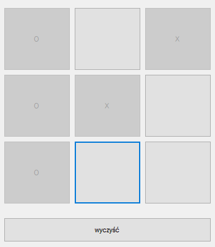

# tictactoe

> This is a simple tic-tac-toe/noughts and crosses game for 2 players written in c# as an assignment for my university

## Table of Contents

* [General Info](#general-information)

* [Technologies Used](#technologies-used)

* [Features](#features)

* [Screenshot](#screenshot)

* [Setup](#setup)

* [Project Status](#project-status)

* [Room for Improvement](#room-for-improvement)

* [Contact](#contact)

## General Information

  A tic-tac-toe game for 2 players
  
  **Rules:**
  
 *Players put Xs and Os on the grid one after the other. 
 The player who succeeds in placing three of their marks in a diagonal, horizontal, or vertical row is the winner.*

## Technologies Used

- C# 7.3

- Visual Studio 2019

- .NET Framework 4.8

## Features

- Support for 2 players

- "Clear" button

## Screenshot

## Setup

For best results compile in Visual Studio

## Project Status

The project is completed and no longer worked on as it's purpose was strictly educational.

## Room for Improvement

### Areas, which could be improved/expanded

- Support for single player aginst ai

- Score counter for each player

## Contact

Created by [@AdamProsniewski](https://github.com/AdamProsniewski) - feel free to contact me!

